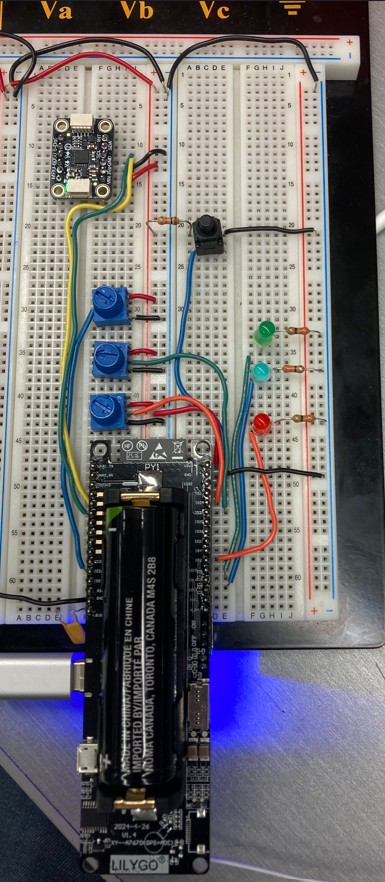
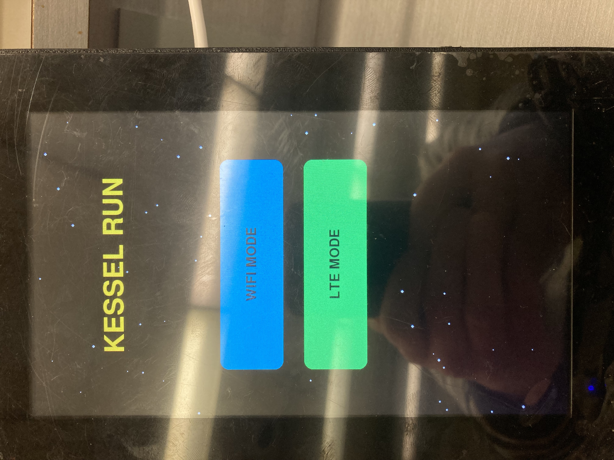
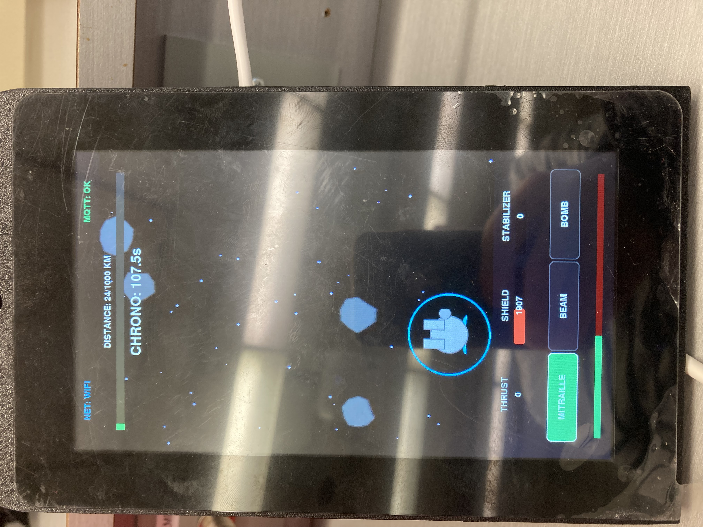
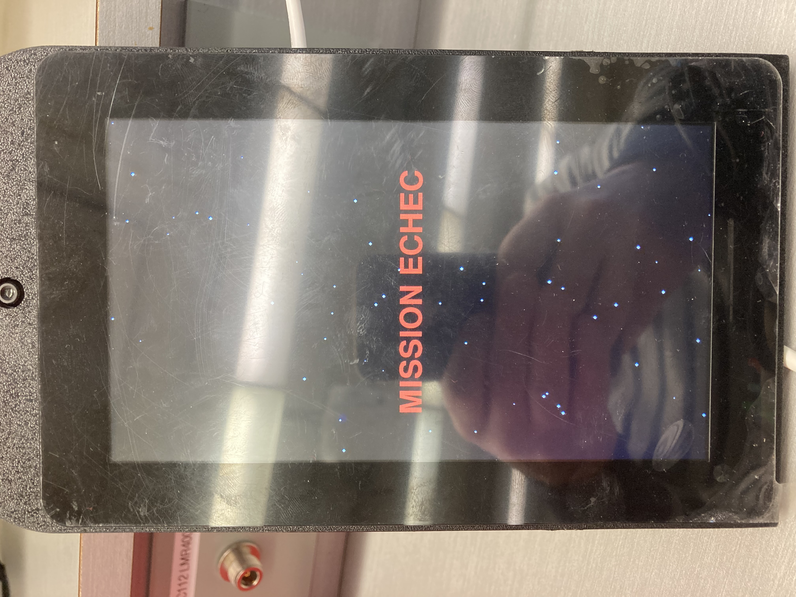

# Projet Mi-Session IoT - Équipe 1 (Kessel Run)

Ce projet est un système IoT interactif complet utilisant un LilyGO T-SIM A7670G (ESP32 + LTE) et un Raspberry Pi 5 avec écran tactile. Le concept est un simulateur de vol spatial inspiré de Star Wars : **Le Raid de Kessel**.

---

## 📸 Galerie du Projet

### Prototype Physique

### Interface Tactile (Raspberry Pi 5)

  
  
  

---

## 🚀 Concept du Jeu
Le joueur pilote le Faucon Millenium à travers un champ d'astéroïdes. L'objectif est de parcourir **1000 km en moins de 120 secondes**. 
- L'inclinaison du LilyGO (accéléromètre) dirige le vaisseau.
- Les potentiomètres gèrent la vitesse, les boucliers et la stabilité.
- Le bouton physique déclenche l'arsenal.

---

## 🛠️ Spécifications Hardware & GPIO

Pour faciliter la reproduction du projet, voici le schéma de câblage détaillé des composants sur le LilyGO A7670G.

| Composant | Pin LilyGO (ESP32) | Type | Fonction en Jeu |
| :--- | :--- | :--- | :--- |
| **MPU6050 (SDA)** | GPIO 21 | I2C | Accéléromètre (Pilotage) |
| **MPU6050 (SCL)** | GPIO 22 | I2C | Accéléromètre (Pilotage) |
| **Bouton Tir** | GPIO 32 | Digital IN | Gâchette de tir (mitraille/bombe) |
| **Potentiomètre 1** | GPIO 36 | Analog IN | Propulsion (Vitesse) |
| **Potentiomètre 2** | GPIO 35 | Analog IN | Bouclier Vampirique |
| **Potentiomètre 3** | GPIO 34 | Analog IN | Stabilisateur Hyperdrive |
| **LED Verte** | GPIO 14 | Digital OUT | Indicateur Arme 1 (Mitraille) |
| **LED Bleue** | GPIO 13 | Digital OUT | Indicateur Arme 2 (Faisceau) |
| **LED Rouge** | GPIO 2 | Digital OUT | Indicateur Arme 3 (Bombes) |

*Note : Tous les composants sont alimentés en **3.3V**.*

---

## 📡 Protocole de Communication (MQTT)

Le système utilise un broker Mosquitto (port 443/WebSockets) avec la racine : `etudiant/guillaume-retier/`.

### Publications (LilyGO → Broker)
- `.../sensors/buttons` : État du bouton (`{"btn1": bool}`)
- `.../sensors/pots`    : Valeurs 0-4095 (`{"pot1": int, "pot2": int, "pot3": int}`)
- `.../sensors/accel`   : Inclinaison (`{"roll": float, "pitch": float}`)
- `.../status`          : Diagnostic (`{"uptime": int, "network": "wifi"|"lte", "rssi": int}`)

### Souscriptions (LilyGO ← Broker)
- `.../actuators/led1`  : Commande LED 1 (`{"state": "on"|"off"}`)
- `.../actuators/led2`  : Commande LED 2
- `.../actuators/led3`  : Commande LED 3
- `.../config`          : Switch réseau (`{"network": "wifi"|"lte"}`)

---

## 📁 Structure et Navigation

Ce dépôt est organisé pour séparer les responsabilités matérielles et logicielles :

- [**`/firmware`**](./firmware/README.md) : Code C++ pour l'ESP32 (Filtrage statistique, gestion LTE/WiFi, MQTT).
- [**`/interface`**](./interface/README.md) : Application Python/Pygame pour le Raspberry Pi 5.
- [**`/kicad`**](./kicad/README.md) : Conception du Shield PCB (schémas et routage).
- [**`/fabrication`**](./fabrication/fabrication-readme.md) : Fichiers Gerbers et BOM pour la production.
- [**`/docs`**](./docs/README.md) : Documentation technique, photos et captures d'écran.

---

## 🔐 Sécurité
Les identifiants sensibles sont isolés dans `auth.h` et `mqtt_config.py`, lesquels sont ignorés par Git. Des modèles sont fournis (`auth.h.example` et `mqtt_config.py.example`).

---
**Auteur :** Guillaume Retier
